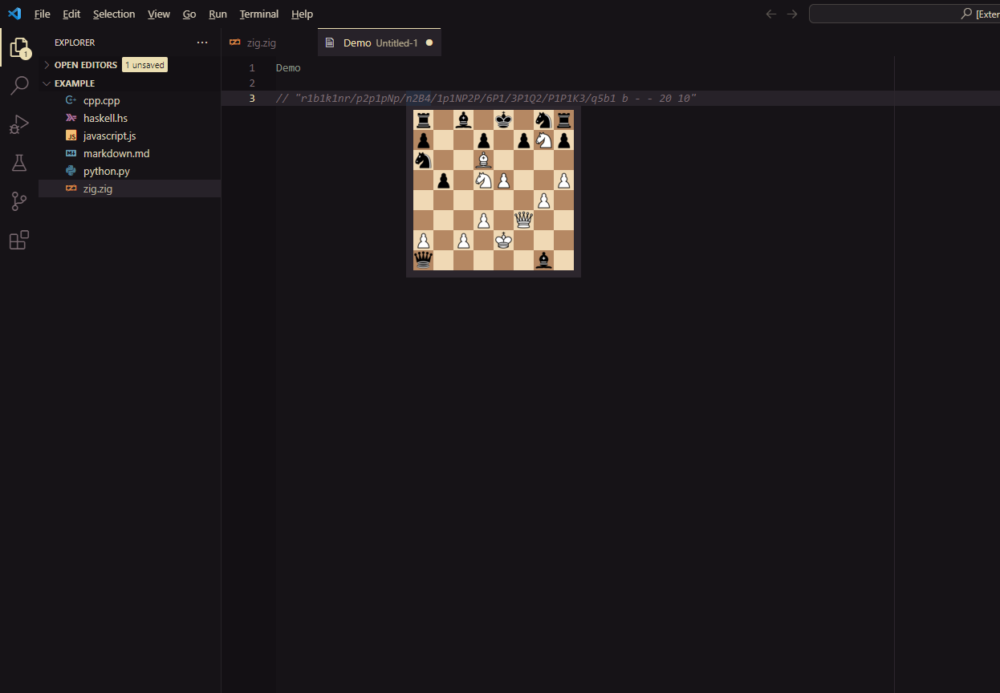

# fen lense

Preview a chess position when hovering above a valid [FEN](https://www.chess.com/terms/fen-chess) string

based on [FEN viewer](https://marketplace.visualstudio.com/items?itemName=asimos-bot.fen-viewer)
by [asimos-bot](https://marketplace.visualstudio.com/publishers/asimos-bot)

## Extension Settings

This extension contributes the following settings:

* `fenlense.showCastlingRights`: Show indicators for who can castle and in wich direction
* `fenlense.showEnpassantSquare`: Show Indicatetor for En Passant target square
* `fenlense.lightSquareColor`: Color of light squares as RGB hex color code
* `fenlense.darkSquareColor`: Color of dark squares as RGB hex color code
* `fenlense.castlingRightsColor`: Color of castling rights indicators as RGB hex color code
* `fenlense.enPassantSquareColor`: Color of En Passant square indicator as RGB hex color code
